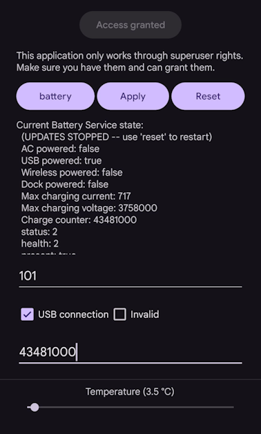

# dumpsys-battery-manager
Change the battery values via dumpsys with the interface. Available to change battery meter, percent, temperature and charging status.
> [!IMPORTANT]
> You are required to have root privileges or Shizuku on your smartphone to use this app.
## Screenshot

